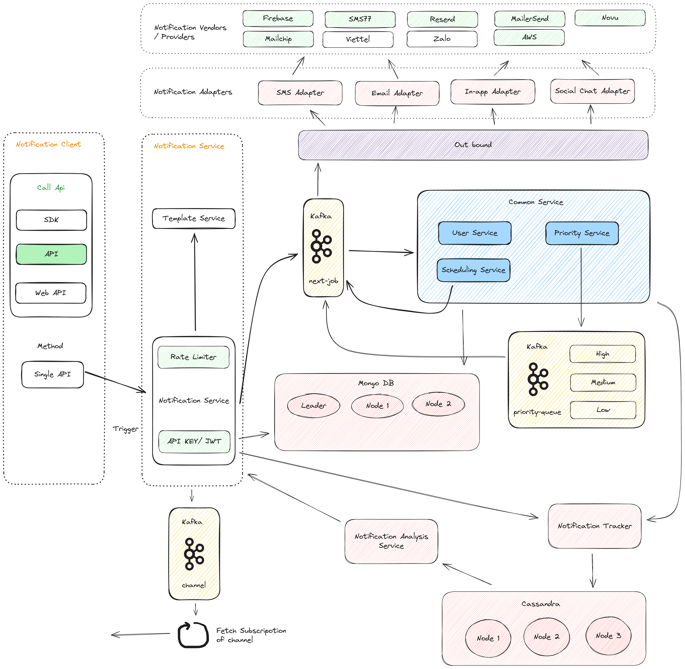
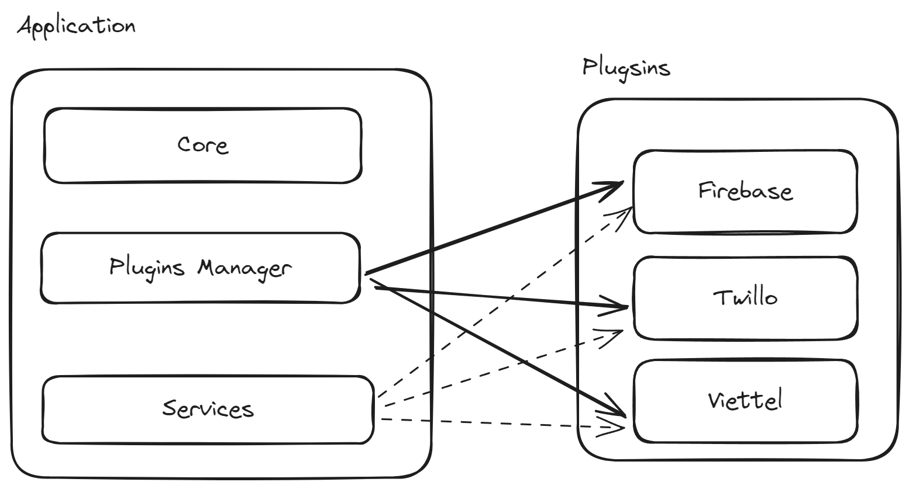

[circleci-image]: https://img.shields.io/circleci/build/github/nestjs/nest/master?token=abc123def456
[circleci-url]: https://circleci.com/gh/nestjs/nest

  <p align="center">WOLFX is a scalability-first, open-source no-code notification platform.<p align="center">
<a href="https://www.npmjs.com/~nestjscore" target="_blank"></a>
<a href="https://www.npmjs.com/~nestjscore" target="_blank"></a>
<!-- <a href="https://circleci.com/gh/nestjs/nest" target="_blank"></a> -->
<a href="https://coveralls.io/github/nestjs/nest?branch=master" target="_blank"></a>
  <a href="https://paypal.me/kamilmysliwiec" target="_blank"></a>
    <a href="https://opencollective.com/nest#sponsor"  target="_blank"></a>
  <a href="https://twitter.com/techlensglobal" target="_blank"></a>
</p>
  <!--[](https://opencollective.com/nest#backer)
  [](https://opencollective.com/nest#sponsor)-->

## Documentation

[Documentation](https://docs.wolfx.app)

## Description

Wolf Notification is a powerful notification infrastructure that helps you deploy multi-channel notifications with ease, allowing you to focus on the user experience.

## Installation

```bash
$ npm i setup
$ npm i install
```

Install worker from repository: [https://github.com/tecklens/tk-wolf-worker](worker)

Install frontend from repository: [https://github.com/tecklens/tk-wolf-admin/blob/main/README.md](Web Admin)

## Running the app

```bash
# development
$ npm run start

# watch mode
$ yarn run start:dev

# production mode
$ npm i -g pm2
$ pm2 start ecosystem.config.js
```

Goto: [http://localhost:5173](http://localhost:5173)

## Test

```bash
# unit tests
$ npm run test

# e2e tests
$ npm run test:e2e

# test coverage
$ npm run test:cov
```

## Support

## Architecture



## Plugin Architecture



## License

Wolfx is [MIT licensed](LICENSE).
